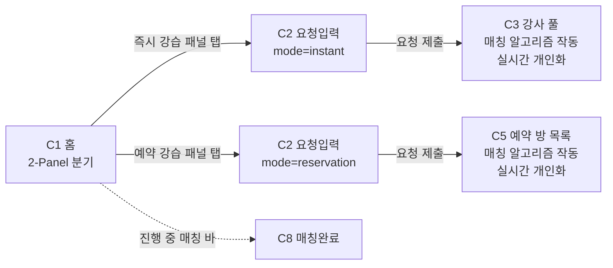

# C1. 홈

> SSING 소비자 앱 첫 화면. **즉시 강습 / 예약 강습** 두 버튼 분기. 분기 = 핵심 경험. 카운트·데이터 노출 없음.

---

## 1. 화면 목적

- 두 매칭 모드(즉시 / 예약) 중 하나로 분기하는 단일 결정 화면
- 위치 자동 감지로 현재 스키장 컨텍스트 확보
- 진행 중인 매칭이 있으면 헤더 아래 컴팩트 알림 바
- **카운트·실시간 데이터는 노출하지 않음** — 매칭 알고리즘은 C2 요청 입력 후 C3/C5 진입 시점부터 작동

> **C1 한정 구조**: 풀스크린 2-Panel로 진행. C2부터는 DESIGN.md 원안대로 카카오T 바텀시트 패턴.

---

## 2. 진입 경로

| 경로 | 트리거 |
|---|---|
| 콜드 스타트 | 앱 아이콘 탭 (온보딩 완료자 한정) |
| 바텀 탭 | "홈" 탭 선택 |
| 매칭 완료 후 복귀 | C9 평가 완료 → "홈으로" |
| 푸시 알림 (일반) | 일반 푸시 클릭 (매칭 관련 푸시는 C3/C5/C8 딥링크) |

---

## 3. 화면 구성

### 레이아웃 구조

```
┌──────────────────────────────┐
│ [핀] 지산리조트          [벨] │ ← 헤더 (56px)
├──────────────────────────────┤
│ ⓘ 오늘 14:00 김OO 강사    >  │ ← 진행 중 매칭 바 (조건부, 44px)
├──────────────────────────────┤
│                              │
│   INSTANT                    │
│   지금 강습                  │ ← 즉시 강습 패널 (60%)
│                              │   Brand 그라데이션
│   요청 즉시 강사 매칭        │
│                              │
│                          →   │
├──────────────────────────────┤
│   RESERVATION                │
│   예약 강습                  │ ← 예약 강습 패널 (40%)
│                              │   Dark #191919
│   원하는 시간에 강사 매칭    │
│                          →   │
├──────────────────────────────┤
│  홈 │ 내역 │ 메시지 │ 내정보  │ ← 바텀 탭
└──────────────────────────────┘
```

### 영역별 상세

#### 영역 1 — 상단 헤더

| 항목 | 스펙 |
|---|---|
| 배경 | `#FFFFFF` |
| 하단 보더 | 1px `#E5E6E8` |
| 높이 | 56px |
| 좌측 | 위치 핀 아이콘 18px `#191919` + 스키장명 16px/600 `#191919` |
| 우측 | 알림 벨 24px (안 읽은 알림 있을 때 6px `#F5444C` 도트) |

#### 영역 2 — 진행 중 매칭 알림 바 (조건부)

조건: 진행 중인 확정 매칭이 1건 이상 존재.

| 항목 | 스펙 |
|---|---|
| 배경 | `#F5F6F7` |
| 높이 | 44px |
| 좌측 | clock 아이콘 16px `#2563eb` (좌 16px 인셋) |
| 텍스트 | "오늘 14:00 · 김OO 강사" 13px/500 `#191919` |
| 우측 | chevron-right 18px `#76787A` (우 16px 인셋) |
| 탭 액션 | C8 매칭 완료 |
| 다중 매칭 | "+N건 더 보기" 칩 우측 추가 |

#### 영역 3 — 즉시 강습 패널 (Hero, 60%)

| 항목 | 스펙 |
|---|---|
| 배경 | 그라데이션 `#1E40AF → #2563EB` (대각선 135deg) |
| 일러스트 오버레이 | 슬로프 라인 SVG, 불투명도 0.12, 우하단 정렬 |
| 패딩 | 32px 24px |
| 탭 영역 | 패널 전체 |
| 프레스 | 그라데이션 밝기 -8% |
| 모션 | 진입 시 fade + Y-translate 12px → 0, `motion-standard` 250ms |

**컨텐츠 (위 → 아래)**

| 행 | 요소 | 스펙 |
|---|---|---|
| 1 | 마이크로 라벨 | "INSTANT" 11px/600 white opacity 0.7 letter-spacing 0.12em |
| 2 | 메인 헤딩 | "지금 강습" 32px/700 `#FFFFFF` |
| 3 | (gap 12px) | |
| 4 | 보조 카피 | "요청 즉시 강사 매칭" 15px/500 white opacity 0.85 |
| 5 | (flex spacer) | |
| 6 | 우하단 화살표 | arrow-right 24px white opacity 0.9 |

#### 영역 4 — 예약 강습 패널 (40%)

| 항목 | 스펙 |
|---|---|
| 배경 | `#191919` |
| 일러스트 오버레이 | 캘린더 그리드 라인 SVG, 불투명도 0.08, 좌하단 정렬 |
| 패딩 | 28px 24px |
| 탭 영역 | 패널 전체 |
| 프레스 | `#0A0A0A` |

**컨텐츠 (위 → 아래)**

| 행 | 요소 | 스펙 |
|---|---|---|
| 1 | 마이크로 라벨 | "RESERVATION" 11px/600 white opacity 0.6 letter-spacing 0.12em |
| 2 | 메인 헤딩 | "예약 강습" 28px/700 `#FFFFFF` |
| 3 | (gap 12px) | |
| 4 | 보조 카피 | "원하는 시간에 강사 매칭" 14px/500 white opacity 0.8 |
| 5 | (flex spacer) | |
| 6 | 우하단 화살표 | arrow-right 22px white opacity 0.8 |

> **컬러 위계**: 즉시 강습 = Brand 블루 = 핵심 USP / 예약 강습 = Dark 블랙 = 신뢰·정돈. DESIGN.md의 "Brand=beacon, Black=grown-up half" 매핑.

#### 영역 5 — 바텀 탭

| 항목 | 값 |
|---|---|
| 배경 | `#FFFFFF` |
| 상단 보더 | 1px `#E5E6E8` |
| 폰트 | 11px/500 Pretendard |
| 활성 | 텍스트/아이콘 `#191919` |
| 비활성 | 텍스트/아이콘 `#A2A4A6` |
| 탭 항목 | 홈 / 내역 / 메시지 / 내 정보 |
| 높이 | 56px + safe-area inset |

---

## 4. 패널 높이 비율 (60:40)

| 영역 | 높이 (iPhone 15 Pro 852px 기준) |
|---|---|
| Safe area top | 59px |
| 헤더 | 56px |
| 진행 중 매칭 바 (조건부) | 44px (없으면 0) |
| 즉시 강습 패널 | 가용 영역의 60% |
| 예약 강습 패널 | 가용 영역의 40% |
| 바텀 탭 + safe area bottom | 84px |

> 비율 근거: 즉시 매칭이 SSING의 핵심 USP. 50:50 동등 분할은 USP 약화로 기각.

---

## 5. 인터랙션

| 트리거 | 결과 |
|---|---|
| 위치 핀 탭 | 스키장 선택 모달 |
| 알림 벨 탭 | 알림 센터 |
| 진행 중 매칭 바 탭 | C8 매칭 완료 |
| 즉시 강습 패널 탭 (전체 영역) | C2 요청입력 (mode=`instant`) |
| 예약 강습 패널 탭 (전체 영역) | C2 요청입력 (mode=`reservation`) |
| 바텀 탭 클릭 | 해당 탭으로 라우팅 |

> 별도 CTA 버튼 없음. **패널 전체 = 탭 영역**. 우하단 화살표는 시각 어포던스만 담당.

---

## 6. 상태 (States)

| 상태 | 처리 |
|---|---|
| 기본 | 두 패널 정상, 진행 중 매칭 바 미노출 |
| 진행 중 매칭 있음 | 알림 바 노출 (44px), 두 패널 높이가 알림 바만큼 줄어듦 |
| 위치 감지 중 | 헤더 위치 텍스트 `#F5F6F7` 스켈레톤 |
| 위치 감지 실패 | 헤더 "위치를 선택하세요" `#76787A`, 탭 시 스키장 선택 모달 |
| 다른 스키장 GPS | 모달 자동 노출 ("OOO에 계신가요?" 확인) |
| 비시즌 (4~11월) | 즉시 강습 패널 dim (`#9CA3AF` 톤다운, 탭 시 토스트 "시즌이 아니에요") / 예약 강습은 8~11월 사전예약 오픈 기간만 활성 |
| 미온보딩 | 진입 차단 → 온보딩 |

---

## 7. Edge Cases

- **푸시 딥링크 진입**: 홈 백스택 유지하고 알림 따라 C3/C5/C8로 점프
- **GPS 미허용**: 헤더 "위치를 선택하세요", 권한 거부 시 수동 선택 영구 유지
- **저사양 디바이스**: 패널 진입 모션 fade only로 단순화 (`prefers-reduced-motion` 동일)
- **다중 진행 매칭**: 가장 임박한 1건 기본 노출 + 우측 "+N" 칩

---

## 8. DESIGN.md 매핑

| 영역 | 토큰 |
|---|---|
| 즉시 강습 BG | Brand `#2563eb` + `#1E40AF` 그라데이션 |
| 예약 강습 BG | Dark `#191919` |
| 헤더 보더 | `#E5E6E8` |
| 진행 중 매칭 바 BG | `#F5F6F7` |
| 일러스트 오버레이 불투명도 | 0.08~0.12 (chrome recede) |
| 마이크로 라벨 | 11px/600 letter-spacing 0.12em (Hero 한정 추가 토큰) |
| 헤딩 Display | 32px/700 (즉시), 28px/700 (예약) |
| 폰트 | Pretendard |
| 모션 | `motion-standard` 250ms 패널 진입, `prefers-reduced-motion` 시 fade only |
| 톤 | "지금 강습" "예약 강습" — 짧은 명사 (DESIGN.md CTA 패턴) |
| 아이콘 | Lucide React (map-pin, bell, clock, arrow-right, chevron-right) |

---

## 9. 라우팅 / 플로우



> **매칭 알고리즘 동작 시점**: C2에서 요청 제출 시. C3·C5는 진입 직후 로딩 상태("조건에 맞는 강사를 매칭중이에요" / "조건에 맞는 방을 매칭중이에요")로 시작하고, 알고리즘 결과가 들어오면서 풀이 실시간으로 채워짐. 매칭 메커니즘 디테일은 C3·C5 정의서에서 다룸.

---

## 10. 변경 이력

| 날짜 | 변경 |
|---|---|
| 2026-05-28 | 초안 (바텀시트 peek + CTA 카드 2개) |
| 2026-05-28 | 2-Panel Hero Split으로 강화 (60:40 + 실시간 가용 카운트) |
| 2026-05-28 | **카운트·데이터 제거하고 단순 두 버튼 분기로 회귀.** 매칭 알고리즘은 C2 제출 시점부터 작동하고, 개인화 풀은 C3·C5에서 처리. Hero Split 구조와 컬러 위계는 유지 |

---

## 11. 다음 화면

- C2 — 요청 입력 (종목 · 레벨 · 인원 · 시간 · 장소 · 소비자정보)
- C3 — 강사 풀 (즉시): 매칭 알고리즘 → 실시간 개인화 풀 + 뷰어 뱃지 + 실시간 입출
- C5 — 예약 방 목록: 매칭 알고리즘 → 실시간 개인화 방 풀 + 뷰어 뱃지
- C8 — 매칭 완료 (진행 중 매칭 바 클릭 시)
