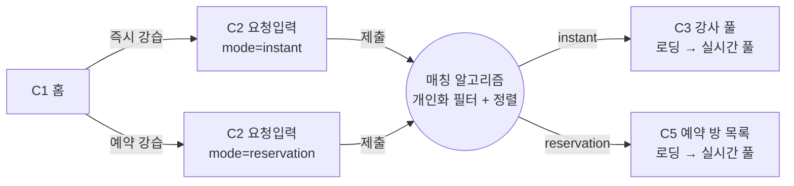

# C2. 요청 입력

> 강습 요청 조건을 입력받아 매칭 알고리즘에 전달하는 화면. 즉시·예약 두 모드 공통이지만 일부 항목 차이. 제출 = 알고리즘 작동 트리거.

---

## 1. 화면 목적

- 강습 요청 조건 (공통 6항목 + 예약 모드 시작 시간 1항목) 입력 수집
- 제출 직후 매칭 알고리즘 작동 → 모드별로 C3 또는 C5 진입
- 입력 자체가 매칭 품질을 결정하므로 누락 없이 완전한 상태로 제출되어야 함

---

## 2. 진입 경로

| 경로 | mode 파라미터 |
|---|---|
| C1 즉시 강습 영역 탭 | `instant` |
| C1 예약 강습 영역 탭 | `reservation` |

---

## 3. 입력 항목 (정보)

### 공통 (즉시·예약)

| # | 항목 | 입력 형식 | 검증 |
|---|---|---|---|
| 1 | 종목 | 스키 / 보드 (단일 선택) | 필수 |
| 2 | 레벨 | 입문 / 초급 / 상급 (단일 선택) + 자유 텍스트 (선택) | 단일 선택 필수, 텍스트는 선택 |
| 3 | 인원 | 1 ~ 5 명 | 필수, 정수 |
| 4 | 시간 길이 | 2시간 / 3시간 / 4시간 (단일 선택) | 필수 |
| 5 | 장소 | 스키장 (자동 위치, 변경 가능) | 자동 감지 실패 시 수동 선택 |
| 6 | 소비자 정보 | 강습받는 사람 각각의 나이 + 성별. 인원수만큼 슬롯 | 모든 슬롯 필수 |

### 예약 모드 전용

| # | 항목 | 입력 형식 | 검증 |
|---|---|---|---|
| 7 | 시작 시간 | 날짜 + 시간 | 현재 +2시간 ~ +3개월 범위 |

> 즉시 모드: 시작 시간 = 요청 시점부터 1시간 내로 자동 설정 (사용자 입력 없음)

---

## 4. 사용자 행동 (기능)

| 행동 | 결과 |
|---|---|
| 각 항목 선택·변경 | 로컬 상태 갱신, 자동 저장 |
| 위치 변경 | 스키장 선택 모달 |
| 인원 수 변경 | 소비자 정보 슬롯 자동 증감 |
| 제출 | 알고리즘 작동 → 즉시: C3 / 예약: C5 진입 (로딩 상태로 받음) |
| 뒤로 가기 | 입력 상태 보존하고 C1으로 복귀. 재진입 시 복원 |

---

## 5. 상태

| 상태 | 처리 |
|---|---|
| 초기 진입 | 종목·레벨·예약 시작 시간 미선택. 인원 1, 시간 2시간, 위치 자동 감지값 기본. 소비자 정보 빈 슬롯 1개 |
| 부분 입력 | 누락 항목 있는 동안 제출 비활성 또는 누락 강조 |
| 위치 자동 감지 실패 | 위치 필드 안내 카피 + 수동 선택 유도 |
| 비시즌 (즉시) | 제출 차단 + 안내 ("강습 시즌이 아니에요") |
| 예약 시간 범위 외 | 시작 시간 입력 시 차단 + 안내 ("최소 2시간 후부터 예약 가능해요") |
| 제출 직후 | 짧은 트랜지션, C3 / C5는 로딩 상태로 진입 |

---

## 6. Edge Cases

- 입력 도중 앱 백그라운드 → 복귀 시 상태 복원
- 위치 변경해도 다른 항목은 유지
- 인원 줄였을 때 — 이미 입력된 소비자 정보 슬롯은 표시 유지하되 초과분에 제거 안내
- 인원 늘렸을 때 — 빈 슬롯 추가
- 자유 텍스트 레벨에 부적절한 내용 — 일단 통과 (필터링은 별도 처리)
- 예약 시작 시간을 입력한 뒤 비시즌으로 넘어가는 경우 — 시즌 범위 안내

---

## 7. 한국어 카피 (확정)

| 위치 | 카피 |
|---|---|
| 모드 표시 (즉시) | "즉시 강습" |
| 모드 표시 (예약) | "예약 강습" |
| 종목 옵션 | "스키" / "보드" |
| 레벨 옵션 | "입문" / "초급" / "상급" |
| 레벨 자유 텍스트 placeholder | "특별히 알려주고 싶은 점이 있으면 적어주세요" |
| 시간 길이 옵션 | "2시간" / "3시간" / "4시간" |
| 성별 옵션 | "남" / "여" |
| 제출 (즉시) | "강사 매칭 시작" |
| 제출 (예약) | "방 매칭 시작" |
| 비시즌 안내 | "강습 시즌이 아니에요" |
| 예약 범위 외 안내 | "최소 2시간 후부터 예약 가능해요" |

---

## 8. 04_matching_system.md 매핑

C2 입력 항목 = 매칭 알고리즘 필터링 조건과 1:1 대응. 제출 시점에 알고리즘이 작동해 사용자별 풀 생성.

| C2 입력 | 04 필터링 기준 |
|---|---|
| 종목 | 정확 일치 |
| 레벨 | 강사·방의 가능 레벨 집합에 포함 |
| 인원 | 강사·방 최대 인원 ≥ 입력 인원 |
| 시간 길이 | 강사·방의 수용 가능 시간 길이 |
| 장소 | 입력 위치 = 강사·방 등록 스키장 |
| 소비자 정보 | 강사 선호 연령대·성별 필터 |
| 시작 시간 (예약) | 방 시작 시간 일치 또는 허용 윈도우 |

---

## 9. 라우팅 / 플로우

---

## 10. 변경 이력

| 날짜 | 변경 |
|---|---|
| 2026-05-28 | 초안 작성. 04에 누락된 "시작 시간 (예약 모드)" 항목 발견하여 04에도 보강 |

---

## 11. 다음 화면

- C3 — 강사 풀 (즉시): 매칭 알고리즘 결과 = 실시간 개인화 풀 + 뷰어 뱃지 + 실시간 입출
- C5 — 예약 방 목록: 동일 메커니즘 (개인화 방 풀)
- (C1로 뒤로 가기 — 입력 상태 보존)
