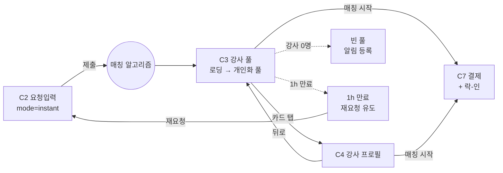

# C3. 강사 풀 (즉시 매칭 결과)

> C2에서 즉시 모드 제출 직후 진입. 매칭 알고리즘이 사용자 조건으로 개인화한 강사 풀을 노출. 풀은 살아 움직임 — 실시간 입출 + 뷰어 뱃지.

---

## 1. 화면 목적

- 로딩 → 개인화된 강사 풀 노출 → 사용자 선택 (강사 카드 탭 → C4) 또는 직접 매칭 시작 (→ C7)
- 풀은 정적 리스트가 아닌 **살아있는 상태** — 강사가 들어오고(가용 ON) 나가고(다른 사용자에게 매칭 확정 시) 함
- 뷰어 뱃지로 적정한 희소성 신호 — "내가 보는 강사를 다른 사용자도 보고 있다"

---

## 2. 진입 경로

| 경로 | 파라미터 |
|---|---|
| C2 즉시 모드 제출 | 6항목 입력 데이터, mode=instant |

---

## 3. 정보·기능

### 정보 (표시할 것)

**화면 메타**
- 매칭 조건 요약 (스키/보드 · 레벨 · 인원 · 시간) — 사용자가 무엇을 요청했는지 컨텍스트
- 현재 풀에 있는 강사 수 (라이브 카운트)
- 풀 활성 시간 (즉시 매칭이므로 1시간 윈도우 표시 또는 카운트다운)

**강사 카드 (풀 내 각 강사)**
- 강사 이름 또는 닉네임
- 등급 (Grade 1~5)
- 평점 (5점 만점)
- 재예약률 (%)
- 거리 (사용자 위치 기준)
- 가격 P (1:1 기준 70,000원)
- 뷰어 뱃지 — "N명이 같이 보고 있어요" (2명 이상일 때만)
- (있다면) 강사 사진 또는 익명 아바타

### 사용자 행동

| 행동 | 결과 |
|---|---|
| 강사 카드 탭 | C4 강사 프로필 진입 |
| 카드 내 "매칭" 직접 액션 (있을 경우) | C7 결제 진입 (락-인 활성화) |
| 정렬 변경 | 풀 재정렬 (등급/평점/거리/가격 등) |
| 뒤로 가기 | C2 요청 입력으로 복귀 (입력 보존) |
| 풀 새로고침 | 강사 풀 갱신 (자동 갱신은 백그라운드, 수동 새로고침은 사용자 명시 갱신) |

### 실시간 동작

- **강사 풀 입출**: WebSocket/SSE로 실시간. 새 강사 진입 시 카드 페이드인, 매칭 이탈 시 페이드아웃
- **뷰어 뱃지 갱신**: 같은 강사를 보는 다른 사용자 수가 변하면 라이브 업데이트
- **카드 락-인**: 다른 사용자가 결제 진행 중인 강사는 차단 또는 풀에서 제거 (정확한 동작은 04 Q-1 미확정)

---

## 4. 한국어 카피 (확정)

| 위치 | 카피 |
|---|---|
| 헤더 상태 (로딩) | "조건에 맞는 강사를 찾고 있어요" |
| 헤더 상태 (풀 활성) | "조건에 맞는 강사 N명" (라이브 카운트) |
| 매칭 조건 요약 prefix | "내 요청 ·" 또는 "요청 조건 ·" |
| 강사 카드 뷰어 뱃지 | "N명이 같이 보고 있어요" |
| 거리 표시 | "OOm" 또는 "OOkm" |
| 가격 prefix | "1:1 강습 ₩" |
| 정렬 옵션 | "추천순" / "등급순" / "평점순" / "거리순" / "가격순" |
| Empty (강사 0명) | "조건에 맞는 강사가 아직 없어요. 강사 등장 시 알림 받기" |
| Loading | "조건에 맞는 강사를 찾고 있어요" + 회전 인디케이터 |

---

## 5. 상태 & Edge Cases

| 상태 | 처리 |
|---|---|
| 초기 로딩 (알고리즘 작동) | 풀이 비어 있고 "찾고 있어요" + 로딩 모션. 강사 들어오기 시작하면 카드 등장 |
| 정상 (풀에 강사 있음) | 강사 카드 리스트 + 라이브 카운트 |
| Empty (강사 0명) | 안내 카피 + 알림 등록 액션 |
| 카드 라이브 입장 | 신규 카드 fade-in 모션 |
| 카드 라이브 퇴장 (매칭 이탈) | fade-out 모션, 빈자리 자연스러운 재배치 |
| 강사 풀 1시간 윈도우 만료 | 풀 자동 닫힘 + 안내 ("매칭 가능 시간이 끝났어요. 다시 요청해보세요") + 재요청 액션 |
| 뷰어 뱃지 0→1→2+ 변동 | 2명 이상일 때만 뱃지 노출, 카운트 변동은 inline |
| 사용자가 카드 탭 → 결제 진입 직후 다른 사용자가 같은 강사 선택 시도 | 락-인으로 차단 — 다른 사용자 풀에서 해당 카드 사라지거나 "방금 매칭이 시작됐어요" 안내 |
| 네트워크 끊김 | 풀 freeze, 안내 카피 + 재연결 시도 |

---

## 6. 04_matching_system.md 매핑

C3는 04 "매칭 알고리즘" 섹션의 출력 단계. 핵심 메커니즘 직접 반영.

| 04 메커니즘 | C3 반영 |
|---|---|
| 알고리즘 작동 (C2 제출 직후) | 진입 시 로딩 상태 |
| 개인화 풀 (조건 부합 강사만) | 사용자별 풀 (전체 풀 아님) |
| 중복 노출 허용 | 같은 강사가 다른 사용자 풀에도 등장 가능 |
| 뷰어 뱃지 — "N명이 같이 보고 있어요" | 강사 카드에 라이브 뱃지 |
| 실시간 입출 | 신규 강사 등장 fade-in, 매칭 이탈 fade-out |
| 락-인 (결제 단계) | C7 진입 시 활성, 다른 사용자에게는 차단/제거 |

---

## 7. 라우팅 / 플로우

---

## 8. 다음 화면

- C4 — 강사 프로필 (카드 탭 시)
- C7 — 결제 (직접 매칭 또는 C4에서 매칭 시작 시)
- C2 — 뒤로 가기 (재요청)
