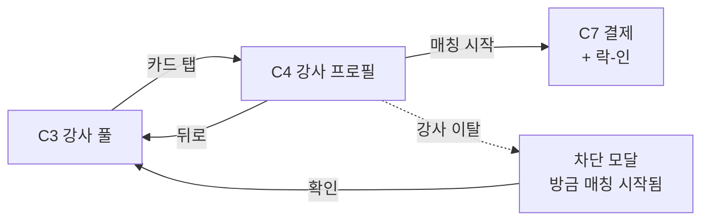

# C4. 강사 프로필

> C3 강사 풀에서 카드 탭 시 진입하는 강사 상세 화면. 사용자가 매칭 확정 전에 강사를 평가·결정하는 정보 집결지.

---

## 1. 화면 목적

- 강사에 대한 충분한 정보를 한 화면에서 검토 — 평점·재예약률·등급·후기·가격
- 결정 액션 = "매칭 시작" → C7 결제 (락-인 활성)
- 뒤로 가기 = C3 풀 복귀 (강사 카드는 풀에 그대로)

---

## 2. 진입 경로

| 경로 | 파라미터 |
|---|---|
| C3 강사 카드 탭 | instructor_id, 매칭 요청 컨텍스트(C2 6항목) 유지 |

---

## 3. 정보·기능

### 정보 (표시할 것)

**강사 프로필 헤더**
- 강사 사진 또는 익명 아바타
- 이름 또는 닉네임
- 등급 (Grade 1~5) — 시각 뱃지 또는 라벨
- 한 줄 소개 (자기소개 1줄)

**핵심 지표 (요약)**
- 평점 (5점 만점, 별 시각화)
- 누적 강습 수
- 재예약률 (%)
- 거리 (사용자 위치 기준)

**가격 정보**
- 1:1 기준 가격 P = ₩70,000
- 매칭 요청 인원에 따른 인당 부담 (가격 모델 A 공식 적용)
- 강사 수령액 (P + (n-1)×α)
- 패찰비 표시 여부 — 강사 부담임을 명시 (사용자 부담 X)

**자기소개 본문**
- 강사가 작성한 자기소개 (전체 텍스트, 펼치기/접기 가능)
- 자격증·경력 (있다면)

**후기 섹션**
- 누적 후기 수
- 후기 리스트 (스크롤) — 평점·텍스트·작성 시기
- 영상 피드백 (있다면 — S-1 미확정 사항이므로 우선 텍스트만)

**뷰어 뱃지 (있을 때)**
- C3 풀과 동일 — "N명이 같이 보고 있어요"

### 사용자 행동

| 행동 | 결과 |
|---|---|
| "매칭 시작" 탭 | C7 결제 진입 (해당 강사 락-인 활성화) |
| 후기 더보기 | 후기 전체 리스트 또는 스크롤 |
| 강사 사진 탭 | 사진 확대 (있을 때) |
| 자기소개 펼치기/접기 | 본문 확장 |
| 뒤로 가기 | C3 강사 풀 복귀 |

---

## 4. 한국어 카피 (확정)

| 위치 | 카피 |
|---|---|
| 매칭 시작 CTA | "매칭 시작" |
| 평점 prefix | "평점" |
| 재예약률 prefix | "재예약" |
| 누적 강습 prefix | "누적 강습" |
| 거리 prefix | "거리" |
| 가격 prefix | "1:1 강습 ₩" |
| 인당 부담 prefix | "1인 부담 ₩" (인원 ≥ 2일 때) |
| 강사 수령 | (사용자에게 노출하지 않음 — 강사 화면 영역) |
| 패찰 안내 | "패찰비는 강사가 부담해요" (인지용, 소형 캡션) |
| 후기 섹션 헤더 | "강습 후기" |
| 후기 비어있음 | "아직 후기가 없어요" |
| 뷰어 뱃지 | "N명이 같이 보고 있어요" |
| 자격증 섹션 | "자격·경력" |

---

## 5. 상태 & Edge Cases

| 상태 | 처리 |
|---|---|
| 정상 (후기 있음) | 후기 최신순 노출, 더보기 |
| 후기 0개 | 안내 카피 + 평점·재예약률은 표시 (있다면) |
| 신규 강사 (Grade 1, 후기 0) | "신규 강사예요" 캡션 |
| 강사가 풀에서 이탈 (보는 중 매칭됨) | 안내 모달 — "이 강사는 방금 매칭이 시작됐어요" + C3 복귀 |
| 강사가 가용 OFF로 전환 | 동일 — "지금은 매칭이 어려워요" + C3 복귀 |
| 매칭 시작 탭 직전 다른 사용자가 먼저 | 결제 진입 차단 + 안내 + C3 복귀 |
| 사진 미등록 | 익명 아바타 + 닉네임 |
| 후기 텍스트가 매우 김 | 펼치기/접기 처리 |

---

## 6. 04_matching_system.md 매핑

| 04 메커니즘 | C4 반영 |
|---|---|
| 가격 모델 A | 인원별 인당 부담 표시 (사용자가 결제 전 확인) |
| 등급제 (재설계 대기) | Grade 1~5 노출. 비금전적 차등(가격 슬라이더 상한 등)은 미확정 — 일단 등급 라벨만 |
| 패찰비 강사 부담 | 사용자에게 안내 캡션 |
| 락-인 (Q-1 미확정) | 매칭 시작 탭 시 락 활성. 다른 사용자에게 차단 |

---

## 7. 라우팅 / 플로우

---

## 8. 다음 화면

- C7 — 결제 (매칭 시작 시)
- C3 — 강사 풀 (뒤로 가기 또는 강사 이탈 차단 시)
