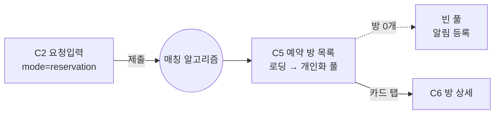

# C5. 예약 방 목록

> C2 예약 모드 제출 후 진입. 매칭 알고리즘이 사용자 조건에 맞춰 큐레이션한 개인화 방 목록. 살아 움직임 — 실시간 입출 + 뷰어 뱃지.

---

## 1. 화면 목적

- 로딩 → 개인화된 방 목록 노출 → 사용자 선택 (방 카드 탭 → C6)
- 방 풀도 C3 강사 풀과 동일 메커니즘 — 정적 리스트 아닌 살아있는 상태
- 새 방 열림 시 추가, 정원 마감·강사 닫기 시 제거

---

## 2. 진입 경로

| 경로 | 파라미터 |
|---|---|
| C2 예약 모드 제출 | 6+1항목 입력 데이터, mode=reservation |

---

## 3. 정보·기능

### 정보 (표시할 것)

**화면 메타**
- 매칭 조건 요약 (스키/보드 · 레벨 · 인원 · 시간 길이 · **시작 시간**)
- 현재 풀에 있는 방 수 (라이브 카운트)

**방 카드 (풀 내 각 방)**
- 강사 정보 요약 (이름/닉네임, 등급, 평점)
- 방 시간 (시작 시간 — 사용자 요청 시간과 정확히 매칭됨)
- 인원 현황 — "N/M명 입장" (현재 입장 / 최대 인원)
- 다중매칭 여부 — 다중 ON/OFF 라벨
- 가격 P (1:1 기준) 또는 현재 인원 기준 인당 부담
- 타임리밋 — 첫 손님 입장 후 추가 입장 가능 시간 (강사 설정)
- 뷰어 뱃지 — "N명이 같이 보고 있어요" (2명 이상)

### 사용자 행동

| 행동 | 결과 |
|---|---|
| 방 카드 탭 | C6 방 상세 진입 |
| 정렬 변경 | 추천순/시간순/평점순/가격순 등 |
| 뒤로 가기 | C2 요청 입력 복귀 (입력 보존) |
| 풀 새로고침 | 수동 갱신 |

### 실시간 동작

- 새 방 열림 (강사가 시간표 슬롯 열기) → 풀 등장 (fade-in)
- 방 정원 마감 → fade-out
- 방 닫힘 (강사가 명시적 닫기) → fade-out
- 인원 현황 라이브 갱신
- 뷰어 뱃지 라이브 갱신

---

## 4. 한국어 카피 (확정)

| 위치 | 카피 |
|---|---|
| 헤더 (로딩) | "조건에 맞는 방을 찾고 있어요" |
| 헤더 (풀 활성) | "조건에 맞는 방 N개" |
| 매칭 조건 prefix | "내 요청 ·" |
| 인원 현황 | "N/M명" |
| 다중매칭 ON 라벨 | "다중 매칭" 또는 "함께 듣기" |
| 다중매칭 OFF 라벨 | "1:1 단독" |
| 타임리밋 prefix | "추가 입장 ~ HH:MM" 또는 "타임리밋 OO분 남음" |
| 가격 prefix | "1인 부담 ₩" (다중매칭) / "1:1 ₩" (단독) |
| 뷰어 뱃지 | "N명이 같이 보고 있어요" |
| Empty | "조건에 맞는 방이 아직 없어요" + "방 열림 시 알림 받기" |
| 정렬 옵션 | 추천순 / 시간순 / 등급순 / 평점순 / 가격순 |

---

## 5. 상태 & Edge Cases

| 상태 | 처리 |
|---|---|
| 로딩 (알고리즘 작동) | 풀 비어있고 "찾고 있어요" + 로딩 모션 |
| 정상 | 방 카드 리스트 + 라이브 카운트 |
| Empty | 안내 + 알림 등록 액션 |
| 신규 방 등장 | fade-in |
| 방 마감/닫힘 | fade-out + 레이아웃 reflow |
| 타임리밋 임박 (예: 5분 미만) | 카드 시각 강조 (warning 톤) |
| 사용자가 이미 입장한 방이 풀에 있을 때 | 카드에 "입장 중" 라벨 + C6 직행 가능 |
| 사용자가 본 방이 마감되면 | 안내 + 풀에서 사라짐 |
| 네트워크 끊김 | 풀 freeze + 안내 |

---

## 6. 04_matching_system.md 매핑

| 04 메커니즘 | C5 반영 |
|---|---|
| 알고리즘 작동 | 진입 시 로딩 |
| 개인화 풀 | 사용자별 방 목록 |
| 중복 노출 허용 | 같은 방이 여러 사용자 풀에 등장 |
| 뷰어 뱃지 | 방 카드에 라이브 뱃지 |
| 실시간 입출 | 신규 방 fade-in, 마감 fade-out |
| 다중매칭 동의 메커니즘 | C6에서 처리 (입장 시 동의 다이얼로그) |
| 타임리밋 | 카드에 표시, C6 입장 후 카운트 |

---

## 7. 라우팅 / 플로우

---

## 8. 다음 화면

- C6 — 방 상세 (카드 탭 시)
- C2 — 뒤로 가기 (재요청)
