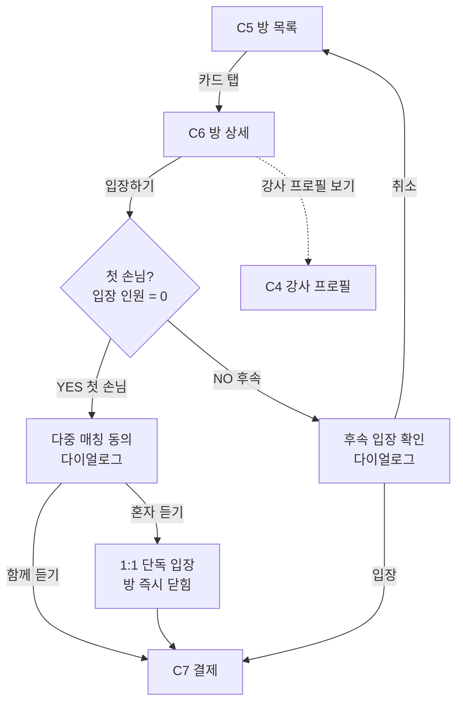

# C6. 방 상세

> C5 방 카드 탭 시 진입. 방 정보 + 강사 정보 + **다중매칭 동의 메커니즘**이 핵심. 입장 시점에 따라 동의 다이얼로그 분기.

---

## 1. 화면 목적

- 방의 모든 정보 확인 — 강사·시간·인원·가격·다중매칭 정책
- 입장 결정 — 다중매칭 동의 처리 후 C7 결제로
- 첫 손님 / 후속 손님에 따라 동의 카피·분기 다름

---

## 2. 진입 경로

| 경로 | 파라미터 |
|---|---|
| C5 방 카드 탭 | room_id, 사용자 요청 컨텍스트(C2) 유지 |
| C5 "입장 중" 방 카드 탭 | 동일 (재입장) |

---

## 3. 정보·기능

### 정보 (표시할 것)

**강사 정보 (요약)**
- 이름/닉네임, 등급, 평점, 재예약률
- (탭하면 C4 강사 프로필로 — 또는 인라인 확장)
- 자기소개 한 줄

**방 정보**
- 시작 시간
- 시간 길이
- 종목 / 가능 레벨 (다중 선택일 수 있음)
- 최대 인원
- 현재 입장 인원 (라이브)
- 다중매칭 ON/OFF
- 가격 (현재 인원 기준 인당 부담, 인원 확정 시 가격 확정 안내)
- 타임리밋 (다중매칭 ON 시) — 첫 손님 입장 후 카운트
- 패찰 안내 (강사 부담)

**현재 입장자 (있다면)**
- 익명 표시 — "OO세 / 성별" (개인 정보 보호)

**뷰어 뱃지**
- "N명이 같이 보고 있어요" — 2명 이상일 때

### 사용자 행동

| 행동 | 결과 |
|---|---|
| "입장하기" 탭 | 다중매칭 동의 다이얼로그 → 동의 시 C7 결제 |
| "강사 프로필 보기" | C4 강사 프로필 진입 |
| 뒤로 | C5 방 목록 복귀 |

### 다중매칭 동의 메커니즘 (04 매칭 시스템 직결)

**첫 손님 입장 시 (현재 입장 인원 = 0)**

| 다이얼로그 카피 | "다른 사람을 추가로 받고 페이를 나눠 내시겠습니까?" |
| 옵션 1: 동의 | 다중매칭 ON 상태로 입장. 타임리밋 카운트 시작 |
| 옵션 2: 거부 | 방이 즉시 1:1로 닫힘. 단독 입장 |

**2~N번째 손님 입장 시 (현재 입장 인원 ≥ 1)**

| 다이얼로그 카피 | "다른 사람들과 함께 들어야 하는 방입니다. 괜찮으십니까?" |
| 옵션 1: 동의 | 입장 → C7 |
| 옵션 2: 거부 | 입장 취소, C5 복귀 |

**레벨 불일치 손님**

방 노출 단계(C5)에서 이미 필터됨 — C6 진입 시점에 레벨은 항상 맞음.

---

## 4. 한국어 카피 (확정)

| 위치 | 카피 |
|---|---|
| 입장 CTA | "입장하기" |
| 첫 손님 동의 다이얼로그 헤더 | "다중 매칭 동의" |
| 첫 손님 동의 본문 | "다른 사람을 추가로 받고 페이를 나눠 내시겠습니까?" |
| 첫 손님 동의 옵션 | "함께 들을게요" / "혼자 들을게요 (1:1)" |
| 후속 손님 동의 다이얼로그 헤더 | "방 입장 확인" |
| 후속 손님 동의 본문 | "다른 사람들과 함께 들어야 하는 방입니다. 괜찮으십니까?" |
| 후속 손님 동의 옵션 | "입장할게요" / "취소" |
| 타임리밋 prefix | "추가 입장 ~ HH:MM" |
| 가격 안내 | "인원 확정 시 가격이 확정돼요" |
| 입장 인원 표시 | "현재 N/M명" |
| 패찰 안내 | "패찰비는 강사가 부담해요" |
| 강사 프로필 보기 액션 | "강사 프로필 보기" |
| 입장자 표시 익명 | "OO세 · 남/여" |
| 방 마감 차단 안내 | "방이 마감됐어요" |

---

## 5. 상태 & Edge Cases

| 상태 | 처리 |
|---|---|
| 첫 손님 (입장 인원 0) | 입장 시 첫 다이얼로그 |
| 후속 손님 (입장 인원 ≥ 1) | 입장 시 후속 다이얼로그 |
| 다중매칭 OFF인 방 (강사 설정) | 다이얼로그 생략, 1:1 직접 입장 |
| 첫 손님이 단독 선택 | 방이 즉시 1:1로 닫힘, 후속 진입 차단 |
| 타임리밋 만료 (다중 ON) | 추가 입장 차단, 인원 확정 |
| 정원 마감 | 입장 차단 + 안내 + C5 복귀 |
| 강사 닫기 (방 명시 종료) | 안내 + C5 복귀 |
| 사용자가 본 중 방 상태 변경 | 라이브 갱신 (입장 수, 타임리밋 등) |
| 사용자가 이미 입장한 방 재진입 | 다이얼로그 생략, C7 결제 미완료면 결제 이어서 |

---

## 6. 04_matching_system.md 매핑

| 04 메커니즘 | C6 반영 |
|---|---|
| 강사 방 설정 항목 (시간·종목·레벨·최대 인원·다중매칭·가격·타임리밋) | 정보 영역에 모두 표시 |
| 다중매칭 동의 메커니즘 (첫·후속·레벨 불일치) | 입장 시 다이얼로그 분기 |
| 인원 확정 메커니즘 | "인원 확정 시 가격 확정" 안내 |
| 가격 모델 A | 현재 인원 기준 인당 표시 |
| 타임리밋 옵션 | 카드·상세에 표시 |

---

## 7. 라우팅 / 플로우

---

## 8. 다음 화면

- C7 — 결제 (동의 후)
- C5 — 방 목록 (뒤로 또는 거부 시)
- C4 — 강사 프로필 (강사 정보 자세히)
