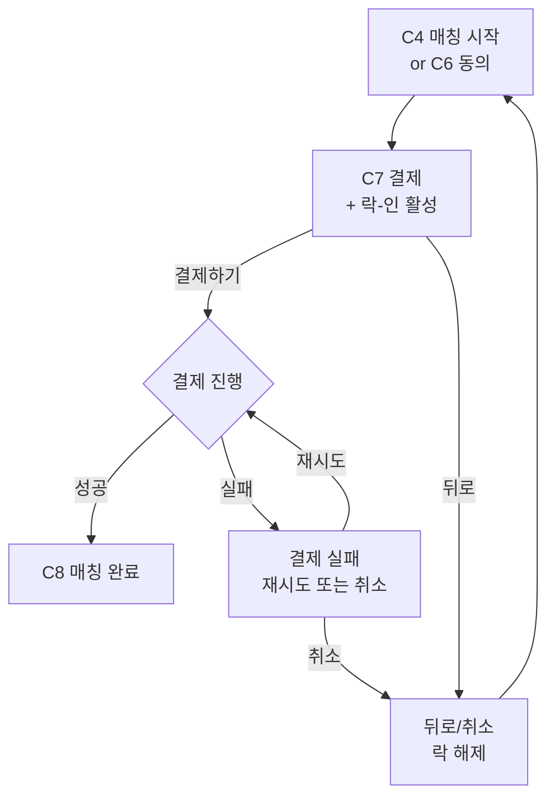

# C7. 결제

> 강습료 결제 화면. 즉시(C4 매칭 시작) 또는 예약(C6 동의 후) 모두 여기로 모임. 가격 모델 A 인당 부담 명시. 락-인 활성 (다른 사용자에 차단).

---

## 1. 화면 목적

- 강사·강습 정보 최종 확인
- 가격 상세 (인당 부담, 강사 수령, 무료화 = SSING 수수료 0%)
- 결제 수단 선택 및 결제 진행
- 결제 완료 → C8 매칭 완료
- 결제 중에는 해당 강사·방이 다른 사용자에게 락 (Q-1 미확정)

---

## 2. 진입 경로

| 경로 | 파라미터 |
|---|---|
| C4 "매칭 시작" 탭 | instructor_id, 즉시 매칭, C2 6항목 |
| C6 첫 손님 "함께 들을게요" | room_id, 다중매칭 ON |
| C6 첫 손님 "혼자 들을게요" | room_id, 1:1 단독 |
| C6 후속 손님 "입장할게요" | room_id, 다중매칭 ON |

---

## 3. 정보·기능

### 정보 (표시할 것)

**강사 정보 (간략)**
- 이름/닉네임, 평점, 등급

**강습 정보**
- 종목, 레벨, 인원, 시간 길이
- 시작 시간 (예약 모드) 또는 "지금 ~ 1시간 내" (즉시 모드)
- 장소 (스키장명)

**가격 상세**
- 1:1 기준 가격 P = ₩70,000
- 다중매칭 시 인당 부담 (현재 인원 기준)
- 인원 미확정 안내 — "인원 확정 후 차액 정산 또는 가결제" (M 미확정사항)
- 강사 수령액 = P + (n-1) × α (강사 화면에 보일 정보, 사용자에게는 노출 여부 미확정)
- **SSING 수수료 = 0%** (무료화 결정 명시 또는 생략)
- 패찰비 = 강사 부담 (소형 안내)

**결제 수단**
- 카드 / 카카오페이 / 토스 등 (구체 PG는 6장 시스템 설계에서 확정)
- 기본값 = 사용자 마지막 결제 수단

**약관 동의**
- 결제 약관, 환불 정책 (미확정 — N-2 취소 정책)

### 사용자 행동

| 행동 | 결과 |
|---|---|
| 결제 수단 변경 | 결제 수단 선택 모달 |
| "결제하기" 탭 | 결제 진행 → 성공 시 C8 / 실패 시 안내 + 재시도 |
| 약관 더보기 | 약관 전문 |
| 뒤로 가기 | 락 해제, 이전 화면 (C4 또는 C6)으로. 동일 강사·방 풀 복귀 |

---

## 4. 한국어 카피 (확정)

| 위치 | 카피 |
|---|---|
| 결제 CTA | "결제하기" |
| 결제 금액 prefix | "결제 금액 ₩" |
| 인당 부담 안내 | "1인 부담 ₩" |
| 인원 미확정 안내 | "인원이 확정되면 정산해드려요" |
| 즉시 모드 시간 | "지금부터 1시간 내 강습" |
| 무료화 안내 (선택) | "SSING 수수료 없음" |
| 패찰 안내 | "패찰비는 강사가 부담해요" |
| 결제 약관 헤더 | "결제 약관" |
| 결제 진행 중 | "결제하고 있어요" |
| 결제 실패 안내 | "결제가 되지 않았어요. 다시 시도해주세요" |
| 결제 수단 변경 | "결제 수단 변경" |
| 뒤로 시 락 해제 안내 (조건부) | "결제를 취소하시겠어요? 다른 분이 이 강사를 매칭할 수 있어요" |

---

## 5. 상태 & Edge Cases

| 상태 | 처리 |
|---|---|
| 진입 직후 | 가격·강사·강습 정보 표시, 결제 수단 기본 선택 |
| 인원 미확정 (예약 다중매칭) | "인원 확정 후 정산" 안내 + 현재 인원 기준 임시 금액 |
| 락 활성화 | 진입 시점에 자동 (다른 사용자 차단) |
| 결제 진행 중 | 로딩 + 차단 |
| 결제 성공 | C8 진입 |
| 결제 실패 | 안내 + 락 유지 + 재시도 옵션 |
| 사용자 결제 중 강사 가용 OFF (즉시) | 결제 차단 + 안내 + 락 해제 |
| 사용자 결제 중 방 마감 (예약) | 결제 차단 + 안내 + 락 해제 |
| 결제 시간 초과 (락 유효 시간 만료, 미확정) | 락 해제 + 안내 |
| 뒤로 가기 | 확인 다이얼로그 → 락 해제 |

---

## 6. 04_matching_system.md 매핑

| 04 메커니즘 | C7 반영 |
|---|---|
| 가격 모델 A | 인당 부담 명시 |
| 무료화 (SSING 수수료 0%) | 결제 금액 = 강사 수령액 (단순) |
| 패찰비 강사 부담 | 사용자 결제액에 미포함 |
| 락-인 (Q-1 미확정) | 진입 시 활성, 뒤로/실패 시 해제 |
| 인원 확정 메커니즘 | 다중매칭 미확정 인원 안내 |
| M. 결제 운영 (미확정) | 가결제 vs 차액 정산 분기 처리 — 일단 "확정 후 정산" 카피 |

---

## 7. 라우팅 / 플로우

---

## 8. 다음 화면

- C8 — 매칭 완료 (결제 성공)
- C4 / C6 — 뒤로 (락 해제)
