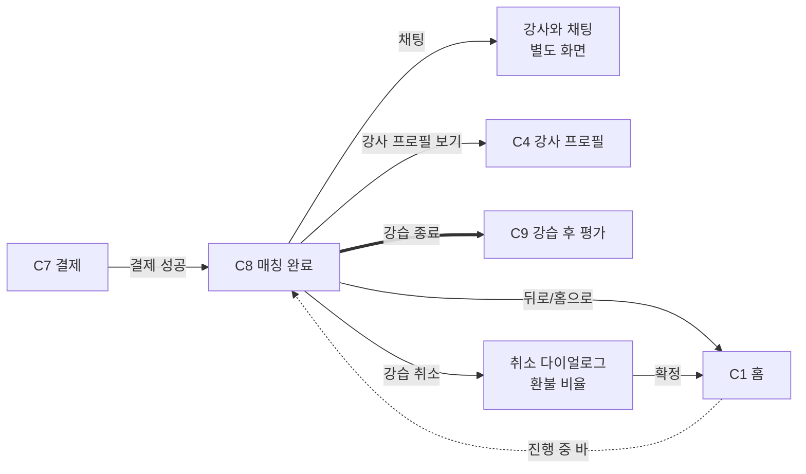

# C8. 매칭 완료

> 결제 성공 후 진입하는 매칭 확정 상태 화면. 강사·강습 정보 + 채팅 진입 (만남 장소 합의용).

---

## 1. 화면 목적

- 매칭 확정 상태를 명확히 전달 (사용자가 안심)
- 강습 정보 (시간·장소·강사·인원) 한 화면 정리
- 강사와 채팅 진입점 (만남 슬로프/장소 합의)
- 강습 시작 시점이 되면 강습 진행 → 강습 종료 후 C9 평가 자동 진입
- C1 홈에서 "진행 중 매칭 바" 탭 시에도 여기로 진입

---

## 2. 진입 경로

| 경로 | 파라미터 |
|---|---|
| C7 결제 성공 | match_id 신규 생성 |
| C1 진행 중 매칭 바 탭 | match_id |
| 푸시 (강습 시작 알림 등) | match_id 딥링크 |
| 바텀 탭 "내역" → 진행 중 매칭 탭 | match_id |

---

## 3. 정보·기능

### 정보 (표시할 것)

**매칭 확정 상태**
- 확정 라벨 (체크 아이콘 + "매칭 확정" 또는 "강습 예약 완료")
- 결제 직후 진입 시 — 완료감 강조 (성공 톤)

**강사 정보**
- 이름/닉네임, 등급, 평점
- 강사 사진 또는 익명 아바타
- (탭 → C4 강사 프로필)

**강습 정보**
- 시작 시간 (즉시: "지금부터 1시간 내" / 예약: "MM월 DD일 HH:MM")
- 시간 길이
- 종목 / 레벨
- 인원 (다중매칭 시 동행자 수 익명 표시)
- 장소 (스키장명 — 정확한 만남 지점은 채팅에서 합의)

**결제 정보 (요약)**
- 결제 금액
- 결제 수단
- 영수증 보기 액션 (선택)

**채팅 진입**
- 강사와의 1:1 채팅 (만남 장소 합의용)
- 마지막 메시지 프리뷰 (있다면)
- 안 읽은 메시지 도트

**다중매칭 동행자 (있을 때)**
- 익명 표시 — "OO세 · 남/여" 형태로 N명
- 그룹 채팅 (강사 + 동행자 전체) 또는 1:1만 (T-1 미확정)

**취소 액션**
- 취소 정책에 따라 (N-2 미확정) — 시점별 환불 비율 안내

### 사용자 행동

| 행동 | 결과 |
|---|---|
| 채팅 진입 | 강사와의 채팅 화면 (별도 — 본 와프 범위 외) |
| 강사 프로필 보기 | C4 강사 프로필 |
| 강습 취소 | 취소 다이얼로그 (환불 비율 안내) → 확정 시 매칭 취소 + 환불 처리 |
| 영수증 보기 | 결제 상세 모달 |
| 뒤로 / 홈으로 | C1 홈 (매칭은 진행 중 상태 유지, C1 진행 중 바에 노출) |

---

## 4. 한국어 카피 (확정)

| 위치 | 카피 |
|---|---|
| 확정 라벨 | "매칭 확정" 또는 "강습 예약 완료" |
| 즉시 매칭 진입 직후 | "강사와 매칭됐어요" |
| 예약 매칭 진입 직후 | "예약이 확정됐어요" |
| 시간 prefix | "강습 시간" |
| 장소 prefix | "장소" |
| 인원 prefix | "인원" |
| 채팅 진입 CTA | "강사와 채팅" |
| 채팅 안내 (만남 합의) | "만나는 슬로프와 시간을 채팅에서 정해주세요" |
| 동행자 라벨 | "함께 듣는 사람" |
| 동행자 익명 | "OO세 · 남/여" |
| 영수증 보기 | "결제 내역 보기" |
| 취소 CTA | "강습 취소" |
| 취소 다이얼로그 (예약 24h 전) | "강습 OO시간 전입니다. 100% 환불돼요" (N-2 미확정) |
| 취소 다이얼로그 (예약 1h 전) | "강습이 임박해 환불이 어려워요" (미확정) |
| 강습 시작 임박 알림 | "곧 강습이 시작돼요" |

---

## 5. 상태 & Edge Cases

| 상태 | 처리 |
|---|---|
| 결제 직후 진입 | 성공 톤 강조 (체크 아이콘 + 확정 라벨) |
| 시간 경과 후 재진입 | 성공 톤 톤다운, 정보 위주 |
| 다중매칭 인원 미확정 (예약, 타임리밋 미만료) | "인원 확정 대기 중" 라벨 + 인원 변동 가능 안내 |
| 인원 확정 (타임리밋 만료) | 인원 확정 + 가격 차액 정산 (M 미확정) |
| 강습 시작 임박 (N분 전) | 푸시 알림 + 화면 상단 강조 |
| 강습 진행 중 | "강습 중" 라벨 + 채팅만 활성 |
| 강습 종료 | 자동 C9 평가 진입 (또는 사용자 트리거) |
| 사용자 취소 | 취소 다이얼로그 + 환불 비율 안내 + 확정 시 환불 처리 |
| 강사 취소 (페널티) | 안내 + 자동 환불 + C1 복귀 |

---

## 6. 04_matching_system.md 매핑

| 04 메커니즘 | C8 반영 |
|---|---|
| 매칭 확정 | 확정 상태 표시 |
| 채팅 (만남 합의용) | 채팅 진입점 |
| 다중매칭 인원 확정 | 인원 변동 안내 → 확정 시 정산 |
| 강습 후 처리 (S 미확정) | 강습 종료 → C9 자동 진입 |
| 취소 정책 (N-2 미확정) | 환불 비율 안내 — 카피 미확정 |

---

## 7. 라우팅 / 플로우

---

## 8. 다음 화면

- 채팅 (별도)
- C4 — 강사 프로필
- C1 — 홈 (매칭 유지)
- C9 — 강습 후 평가 (강습 종료 시)
