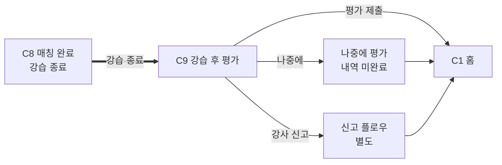

# C9. 강습 후 평가

> 강습 종료 후 자동 또는 사용자 트리거로 진입. 평점·후기·(선택) 영상 피드백. 평가 누적이 강사 등급 변동 트리거.

---

## 1. 화면 목적

- 강사·강습에 대한 평가 수집 (평점 + 후기)
- 누적 평가 → 강사 등급 산정 데이터 (등급제 재설계 대기 — Grade 1~5)
- 재예약률 갱신
- 평가 제출 후 C1 홈으로 복귀

---

## 2. 진입 경로

| 경로 | 파라미터 |
|---|---|
| 강습 종료 자동 진입 | match_id |
| C8 "강습 완료" 사용자 트리거 | match_id |
| 푸시 (강습 종료 + N분) | match_id 딥링크 |

---

## 3. 정보·기능

### 정보 (표시할 것)

**강사 정보 (간략)**
- 이름/닉네임, 사진/아바타
- (탭 → C4 강사 프로필)

**강습 정보 (요약)**
- 시작 시간 / 종료 시간
- 종목 · 레벨 · 인원

**평가 입력**

| 항목 | 형식 | 필수 |
|---|---|---|
| 평점 | 5점 만점 (별 5개) | 필수 |
| 후기 | 자유 텍스트 | 선택 (권장) |
| 영상 피드백 | 영상 첨부 (S-1 미확정) | 선택 |
| 재예약 의향 | "이 강사에게 다시 강습받고 싶어요" 체크 (재예약률 산정) | 선택 |
| 신고 | "강사에 문제가 있어요" — 별도 플로우 (사고/부적절 행동 등) | 선택 |

**세부 평가 (선택)** — S-1 미확정이므로 일단 기본 평점만, 향후 세부 항목 추가 가능
- 강습 진행 / 친절함 / 시간 준수 / 전문성 등

### 사용자 행동

| 행동 | 결과 |
|---|---|
| 별 평점 선택 | 평점 입력 |
| 후기 텍스트 입력 | 후기 입력 |
| 영상 첨부 (있다면) | 영상 업로드 |
| "재예약 의향" 체크 | 재예약률 산정에 반영 |
| "강사 신고" 탭 | 신고 플로우 (별도) |
| "평가 제출" 탭 | 평가 저장 → 등급 데이터 갱신 → C1 홈 복귀 |
| "나중에 평가" 탭 | C1 복귀, 평가 미완료 상태로 내역에 남음 |

---

## 4. 한국어 카피 (확정)

| 위치 | 카피 |
|---|---|
| 화면 헤더 | "강습은 어떠셨어요?" |
| 평점 prompt | "별점을 선택해주세요" |
| 평점 라벨 (1~5점) | 1점 "별로예요" / 2 "아쉬워요" / 3 "괜찮아요" / 4 "좋아요" / 5 "최고예요" |
| 후기 placeholder | "강습에서 좋았던 점, 아쉬웠던 점을 자유롭게 적어주세요" |
| 영상 첨부 (있다면) | "영상으로 피드백 받기" |
| 재예약 의향 | "이 강사에게 다시 강습받고 싶어요" |
| 신고 | "강사에 문제가 있어요" (소형, 보조 액션) |
| 제출 CTA | "평가 제출" |
| 나중에 평가 | "나중에 평가" |
| 제출 후 안내 | "평가가 등록됐어요. 감사해요." |
| 평가 미완료 안내 (내역) | "평가가 남았어요" |

---

## 5. 상태 & Edge Cases

| 상태 | 처리 |
|---|---|
| 초기 진입 | 평점 미선택, 후기 빈칸. 제출 버튼은 평점 선택 시 활성 |
| 평점 선택 후 | 라벨 표시 (1~5점 카피) + 제출 활성 |
| 후기 미입력 + 제출 | "후기 없이 평가하시겠어요?" 확인 (선택 — 후기 권장) |
| 영상 업로드 중 | 진행률 + 차단 |
| 영상 업로드 실패 | 안내 + 재시도 또는 영상 없이 제출 옵션 |
| "나중에 평가" 선택 | C1 복귀, 내역에 미완료 표시. 일정 기간 후 자동 만료 (미확정 — S-2 등급 산정 주기와 연동) |
| 강습 직후 진입 | 신선한 기억 톤 |
| 강습 후 시간 경과 진입 | "OO일 전 강습" prefix |
| 사고/부적절 행동 신고 | 신고 별도 플로우 (개인정보·법적 처리) |

---

## 6. 04_matching_system.md / 03 매핑

| 04 / 03 메커니즘 | C9 반영 |
|---|---|
| 등급 결정 기준 (평점 + 재예약률 × 누적 강습량) | 평점·재예약 의향 수집 |
| 등급제 재설계 대기 (비금전적 차등) | 평가 항목 구조는 유지, 등급 매핑은 미확정 |
| 강습 후 처리 (S-1/2/3 미확정) | 영상 피드백·등급 산정 주기·재예약 메커니즘 — 카피만 명시, 구체 동작은 후속 |

---

## 7. 라우팅 / 플로우

---

## 8. 다음 화면

- C1 — 홈 (평가 제출 후 복귀)
- 내역 (평가 미완료 상태로 잔존)
- 신고 플로우 (별도)
