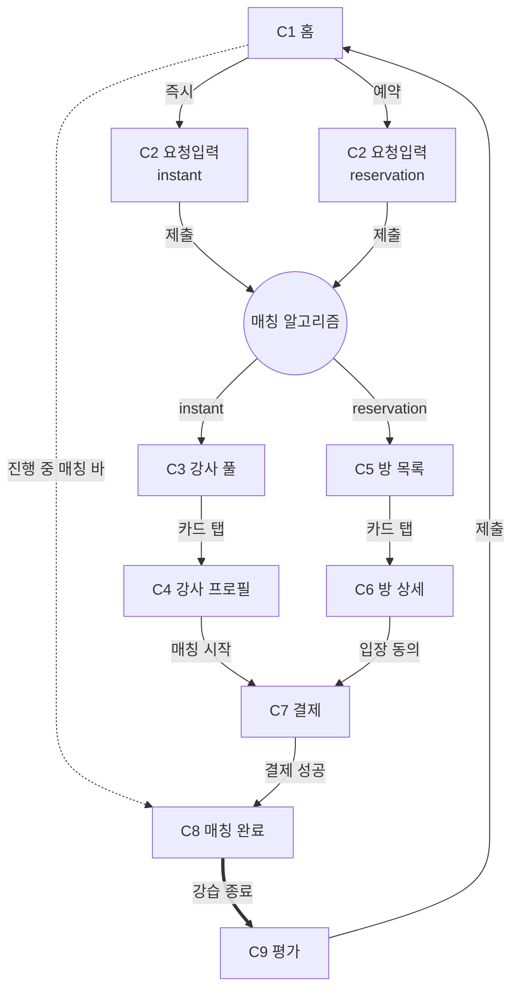

# SSING Wireframes — 소비자 앱 C1~C9

> 텍스트 화면 정의서 + Figma Make 통합 합본. C1~C9는 소비자 앱 전체 플로우.

---

## 폴더 구조

| 파일 | 용도 |
|---|---|
| `01_C1_home.md` ~ `09_C9_rating.md` (9개) | 한국어 화면 정의서 — 노션 산출물 |
| `figma_make_all_screens.md` | Figma Make 통합 합본 — 9개 화면 자기완결 코드블록 |
| `README.md` | 이 파일 |

---

## 화면 인덱스

| # | 화면 | 핵심 |
|---|---|---|
| C1 | 홈 | 즉시/예약 모드 분기 |
| C2 | 요청 입력 | 6+1항목 → 알고리즘 트리거 |
| C3 | 강사 풀 (즉시) | 개인화 풀 + 뷰어 뱃지 + 실시간 입출 |
| C4 | 강사 프로필 | 평점·후기·매칭 시작 |
| C5 | 예약 방 목록 | 개인화 방 풀 |
| C6 | 방 상세 | 다중매칭 동의 메커니즘 |
| C7 | 결제 | 가격 모델 A, 락-인 |
| C8 | 매칭 완료 | 확정 + 채팅 |
| C9 | 강습 후 평가 | 평점·후기·재예약 |

---

## Figma Make 사용 흐름

1. `figma_make_all_screens.md` 열기
2. 던질 화면 섹션 찾기 (C1 ~ C9)
3. 해당 코드블록 ``` 내부 ``` 통째 복사
4. Figma Make 입력창에 붙여넣기 → 생성
5. 결과 검토 → 톤·디테일 어긋나면 해당 코드블록의 CONSTRAINTS / DESIGNER DECISIONS 보강 후 재생성

---

## 매칭 메커니즘 (전 화면 공통, `../04_matching_system.md` 참조)

- 알고리즘 작동 = C2 제출 직후
- C3·C5는 진입 즉시 로딩 상태
- 풀은 사용자별 개인화 — 같은 강사·방이 여러 사용자 풀에 동시 노출 가능
- 뷰어 뱃지: 2명 이상이 같은 강사·방을 볼 때 "n명이 같이 보고 있어요"
- 실시간 입출 — 매칭 확정 시 풀에서 사라짐, 신규 가용 시 추가
- 결제 단계 락-인: 다른 사용자 차단 (Q-1 미확정)

---

## 화면 플로우



---

## 미확정 사항 (`../05_pending_decisions.md` 연동)

C2~C9 정의서에 영향을 주는 미확정 항목. 와프는 합리적 추정으로 작성.

| 코드 | 미확정 | 영향 화면 |
|---|---|---|
| M | 결제 운영 (가결제 vs 차액 정산) | C7 |
| N-2 | 취소 정책 (시점별 환불, 강사 페널티) | C7, C8 |
| O-1~5 | 즉시 매칭 운영 (풀 필터·정렬·빈 풀) | C3 |
| P-1~3 | 강사 가용 시스템 | C3 (간접) |
| Q-1~3 | 락-인·실시간 처리 | C3, C5, C7 |
| S-1~3 | 강습 후 처리 (영상·등급 산정·재예약) | C9 |
| T-1 | 채팅 종료 시점, 통화 가능 여부 | C8 |
| 등급제 재설계 | 비금전적 차등 메커니즘 | C3, C4 |
